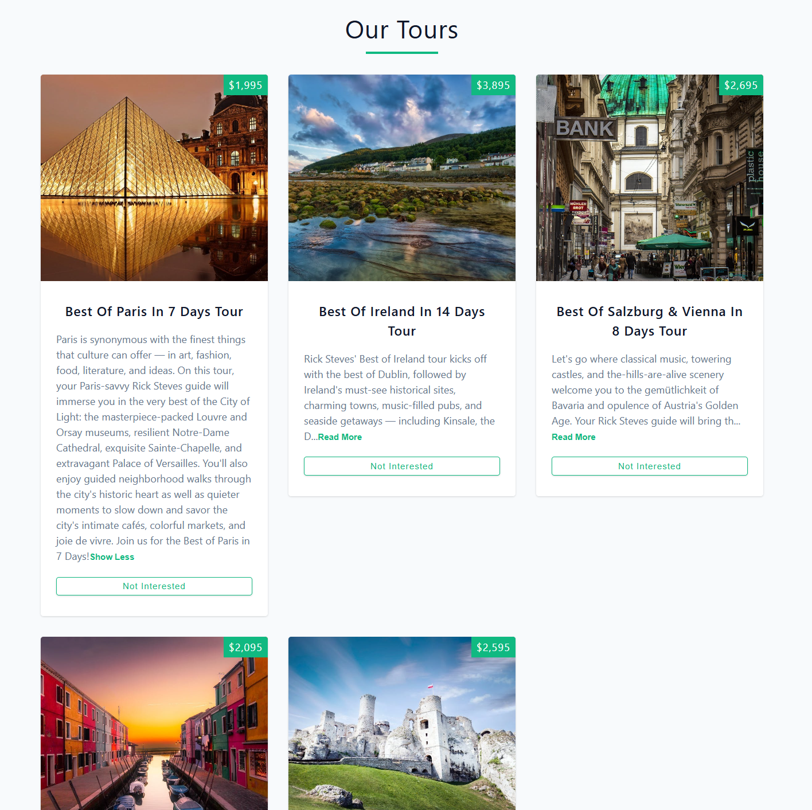

## 🌍 Tours App

An interactive React application that fetches and displays tours from an external API. Users can remove tours from the list or refresh the data.

---

### 🚀 Features

- Fetch data from a remote API  
- Display a list of tours  
- Ability to remove tours  
- "Refresh" button when all tours are removed  
- State management using `useState` and `useEffect`
- Conditional components Loading, Read more

---

### 🛠️ Technologies Used

- **React**
- **React Hooks**: `useState`, `useEffect`
- **CSS** for styling (Grid or Flexbox)

---

### 📦 Installation & Setup

```bash
git clone https://github.com/Snapix07/Tours.git
cd tours-app
npm install
npm start
```

---

### 📁 Project Structure

```
/src
├── App.js
├── index.js
├── Tours.js
├── Tour.js
└── App.css
```

---

### 🔗 API Source

API used to fetch tours:

```js
const url = 'https://course-api.com/react-tours-project';
```

---

### ⚙️ Key Hooks Usage

```js
const [loading, setLoading] = useState(true);
const [tours, setTours] = useState([]);

useEffect(() => {
  fetchTours();
}, []);

const fetchTours = async () => {
  setLoading(true);
  try {
    const response = await fetch(url);
    const tours = await response.json();
    setTours(tours);
    setLoading(false);
  } catch (error) {
    setLoading(false);
    console.error(error);
  }
};
```

---

### 📸 Screenshots



